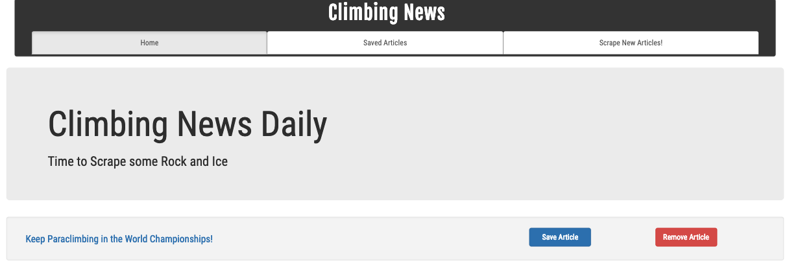
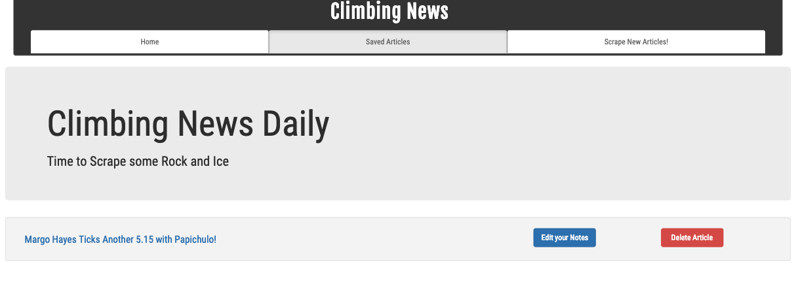
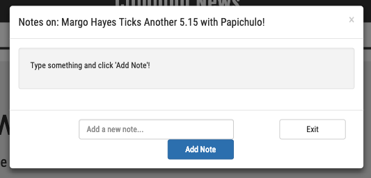
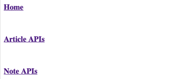
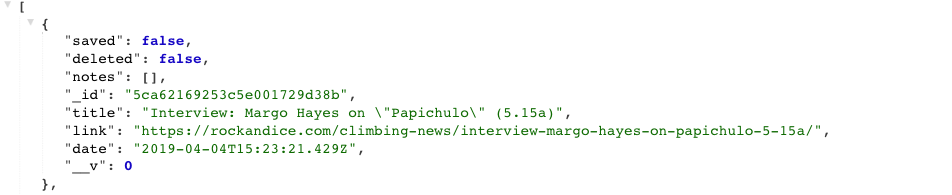

# News Scraper

# Overview

Web app that lets users scrape news articles from Rock and Ice, view, and leave comments on chosen saved articles. Articles are scraped with Cheerio and stored with Mongoose.

# Usage

This application has been deployed to Heroku and can be ran locally.

* `https://intense-meadow-92410.herokuapp.com/` - Heroku

## Page Views

### Home Page


### Saved Articles Page


### Notes Modal


### API Page


### JSON parsed API call Page



## Technology used to build News-Scraper

- HTML
- CSS
- Bootstrap - https://getbootstrap.com/docs/3.3/getting-started/
- JavaScript
- Node.js
- MongoDB - https://www.mongodb.com/download-center/
- Handlebars NPM Package - https://www.npmjs.com/package/express-handlebars/
- Body-Parser NPM Package - https://www.npmjs.com/package/body-parser 
- Method-override NPM Package - https://www.npmjs.com/package/method-override
- Mongoose NPM Package - https://www.npmjs.com/package/mongoose
- Mongoose-unique-validator - https://www.npmjs.com/package/mongoose-unique-validator
- express NPM Package - https://www.npmjs.com/package/express
- cheerio NPM Package - https://www.npmjs.com/package/cheerio
- morgan NPM Package - https://www.npmjs.com/package/morgan
- router NPM Package - https://www.npmjs.com/package/router
- request NPM Package - https://www.npmjs.com/package/request

### Prerequisites

```
- Node.js - Download the latest version of Node https://nodejs.org/en/
```


## Author

* **Thomas Headle** - [Thomas-Headle](https://github.com/TGHeadle1371/news-scraper)